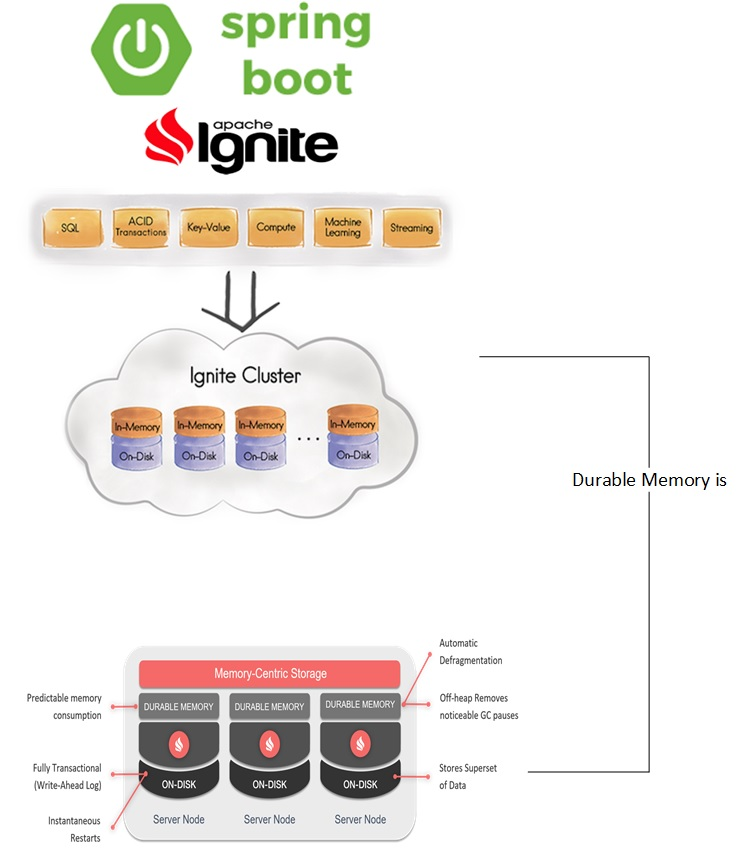
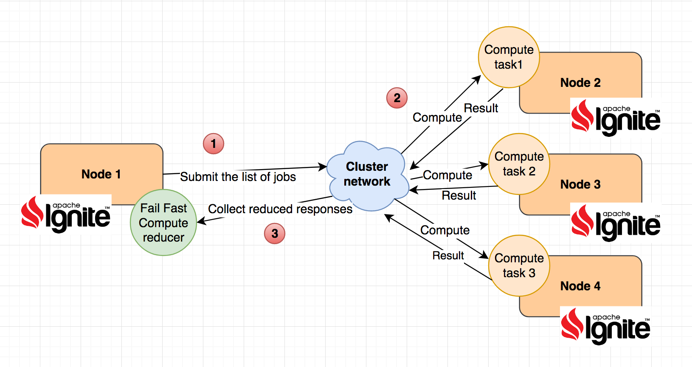

# Spring Boot integration with Apache Ignite and its durable memory and sql queries over cache 

show case for how integrate apache ignite with spring boot plus using the durable memory feature and sql queries over ignite in memory caches

* Integrate spring boot with Apache Ignite
* How to enable and use persistent durable memory feature of Apache Ignite which can persist your cache data to the file disk to survive crash or restart so you can avoid data losing.
* How to execute SQL queries over ignite caches
* How to unit test and integration test ignite with spring boot
* Simple Jenkins pipeline reference
* How to do fail fast map reduce parallel jobs execution in sync and async way 

## How it is integrated with spring boot :

## How to handle parallel fail fast map reduce jobs in sync and async way:

## for more detailed technical information please check my post :
Spring boot with Ignite durable memory and SQL queries :
https://mromeh.com/2017/11/17/spring-boot-with-apache-ignite-persistent-durable-memory-storage-plus-sql-queries-over-ignite-cache/

And for fail fast map reduce jobs in ignite compute grid:
https://mromeh.com/2017/12/18/spring-boot-with-apache-ignite-fail-fast-distributed-map-reduce-closures/
