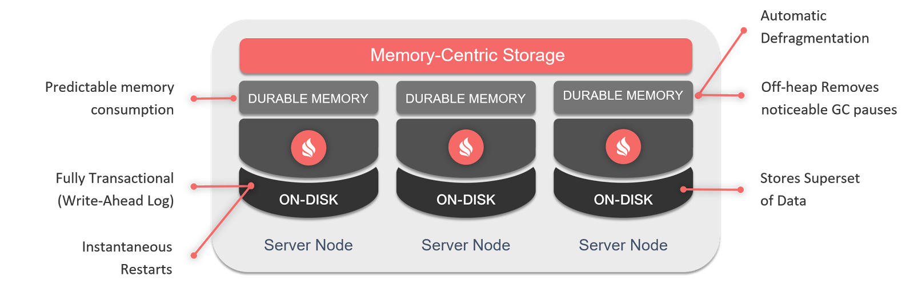

# spring-boot-ignite

show case for how integrate apache ignite with spring boot plus using the durable memory feature and sql queries over ignite in memory caches

how durable memory to disk is designed : 

